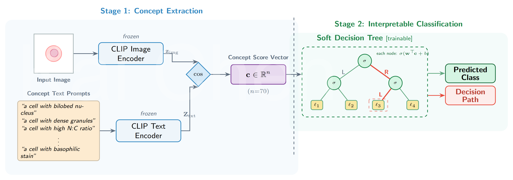

# Interpretable Peripheral Blood Cell Classification via Vision-Language Concept Bottleneck and Soft Decision Tree

[](LICENSE)



This repository contains the code and data for the paper:

> **Interpretable Peripheral Blood Cell Classification via Vision-Language Concept Bottleneck and Soft Decision Tree**
> [Journal citation to be added upon acceptance]

## Overview

We propose an interpretable blood cell classification pipeline that replaces black-box neural representations with human-understandable morphological concept scores:

1. **ConceptCLIP image embeddings** are extracted from [BloodMNIST](https://medmnist.com/) (8 classes, ~17,000 images at 224×224).
2. **Concept score vectors** are computed by comparing image embeddings against 70 text-described morphological concepts (nuclear morphology, cytoplasmic features, granules, non-leukocyte elements) using ConceptCLIP's text encoder.
3. A **Soft Decision Tree (SDT)** trained on these 70-dimensional concept vectors achieves **94.86% test accuracy** — a 3.12% absolute reduction from the CLIP baseline — while providing fully interpretable decision paths.

```
BloodMNIST images (224×224)
        ↓ ConceptCLIP image encoder  [GPU, ~45 min]
CLIP image embeddings (1152-dim)
        ↓ text encoder × 70 concepts  [GPU, ~3 min]
Concept score vectors (70-dim)
        ↓ Soft Decision Tree
Interpretable classification (94.86% test accuracy)
```

## Repository Structure

```
CLIP-CBM-SoftDecisionTree/
├── SDT_pt.py                          # PyTorch Soft Decision Tree implementation
├── SDT_pt_function.py                 # Checkpoint loading utility
├── sdt_visualization.py               # Tree visualization and node analysis
│
├── [1]image_embedding_inference.ipynb # Step 1: Extract ConceptCLIP image embeddings
├── [2]Classify_img_embedding.ipynb    # Step 2: Baseline classifiers on image embeddings
├── [3]concept_score_vector_generation.ipynb  # Step 3: Generate concept score vectors
├── [4]CSV_downstream_analysis.ipynb   # Step 4: Concept-bottleneck classifiers
├── [5]SDT_training.ipynb              # Step 5: Train Soft Decision Tree
├── [6]SDT_analysis.ipynb              # Step 6: Visualize SDT and analyze nodes
│
├── checkpoints/
│   └── sdt_bloodmnist_concept70.pt    # Trained SDT weights (94.86% test accuracy)
│
├── data/
│   ├── concept_30/                    # 30-concept score vectors (train/val/test CSVs)
│   ├── concept_50/                    # 50-concept score vectors
│   ├── concept_70/                    # 70-concept score vectors  ← used by SDT
│   └── concept_90/                    # 90-concept score vectors
│   # Note: image_features_*.csv (CLIP embeddings, ~237 MB total) are zipped in image_features_test.7z.
│
├── requirements.txt
└── LICENSE
```

## Requirements and Installation

**Tested environment:**
- Python 3.10
- Pytorch 2.0.0
- GPU required for notebooks `[1]` (image embedding inference) and `[3]` only.

**Install dependencies:**
```bash
pip install -r requirements.txt
```

**Authenticate with Hugging Face** (required to download the ConceptCLIP backbone):
```bash
# Option A: environment variable (recommended)
export HF_TOKEN=<your_huggingface_read_token>   # Linux/Mac
set HF_TOKEN=<your_huggingface_read_token>       # Windows

# Option B: interactive login
huggingface-cli login
```
Get a free read-only token at [huggingface.co/settings/tokens](https://huggingface.co/settings/tokens).

ConceptCLIP: [https://huggingface.co/JerrryNie/ConceptCLIP](https://huggingface.co/JerrryNie/ConceptCLIP)

## Data

### BloodMNIST (raw images)
The dataset is **automatically downloaded** via the MedMNIST API when you run notebook `[1]`:
```python
medmnist.BloodMNIST(split='train', size=224, download=True)
```
No manual download required.

### Pre-computed ConceptCLIP image embeddings
The CLIP image embeddings (train/val/test, 1152-dim, total ~237 MB) are too large, thus we zip them into `image_features_test.7z` (165 MB) for easier download and storage:

**Unzip:**

After unzipping, the `data/` directory should have the following structure with three CSV files containing the image embeddings:
```
data/
├── image_features_train.csv   (165 MB, 11,959 rows × 1155 cols)
├── image_features_val.csv     (24 MB,  1,712 rows × 1155 cols)
└── image_features_test.csv    (47 MB,  3,421 rows × 1155 cols)
```
CSV column format: `id, label, split, f0, f1, ..., f1151`

These files are only needed to run notebooks `[2]` and `[3]`. If you only want to reproduce the SDT results, skip to **Quick Start** below.

### Concept score vectors (included in this repo)
Pre-computed concept score vectors for all four granularities are included under `data/concept_{30,50,70,90}/`. These are the direct inputs to notebooks `[4]`, `[5]`, and `[6]`.

## Notebooks

Run notebooks in order from the repo root directory. All notebooks use relative paths (`./data/`, `./checkpoints/`).

| # | Notebook | Purpose | GPU? | Est. runtime |
|---|----------|---------|------|--------------|
| 1 | `[1]image_embedding_inference.ipynb` | Extract ConceptCLIP image embeddings from BloodMNIST | Yes | ~45 min |
| 2 | `[2]Classify_img_embedding.ipynb` | Black-box baseline classifiers (LR, SVM, MLP, XGBoost) on image embeddings | No | ~5 min |
| 3 | `[3]concept_score_vector_generation.ipynb` | Compute concept score vectors for all 4 granularities | Yes | ~3 min |
| 4 | `[4]CSV_downstream_analysis.ipynb` | Concept-bottleneck classifiers at each granularity | No | ~10 min |
| 5 | `[5]SDT_training.ipynb` | Train Soft Decision Tree on 70-concept vectors | No (CPU) | ~variable |
| 6 | `[6]SDT_analysis.ipynb` | Load checkpoint, visualize tree, analyze internal nodes | No | ~5 min |

## Quick Start: Reproduce Paper Results

To reproduce the SDT results and figures **without re-running GPU inference**:

```bash
# 1. Clone the repository
git clone https://github.com/aquamarineaqua/CLIP-CBM-SoftDecisionTree.git
cd CLIP-CBM-SoftDecisionTree

# 2. Install dependencies
pip install -r requirements.txt

# 3. The concept_70 vectors and trained checkpoint are already in the repo.
#    No download needed for SDT analysis.

# 4. Open and run notebook [6] to reproduce all SDT analysis figures
jupyter notebook "[6]SDT_analysis.ipynb"
```

The checkpoint at `checkpoints/sdt_bloodmnist_concept70.pt` achieves **94.86% test accuracy** on the 3,421-image BloodMNIST test set.

## Results Summary

| Model | Features | Test Accuracy |
|-------|----------|---------------|
| CLIP (black-box baseline) | 1152-dim image embeddings | 97.98% |
| Logistic regression | 70 concept scores | 96.11% |
| **Soft Decision Tree (ours)** | **70 concept scores** | **94.86%** |

The SDT's 3.12% accuracy trade-off over the black-box baseline comes with full decision-path interpretability: each prediction is explainable as a sequence of morphological concept comparisons.

## Availability Statement

The source code, pre-trained model checkpoint, and concept score vectors are freely available at this repository (MIT License). The BloodMNIST dataset is publicly available through [MedMNIST](https://medmnist.com/) and is automatically downloaded via the MedMNIST API. The ConceptCLIP backbone is available at [https://huggingface.co/JerrryNie/ConceptCLIP](https://huggingface.co/JerrryNie/ConceptCLIP).

